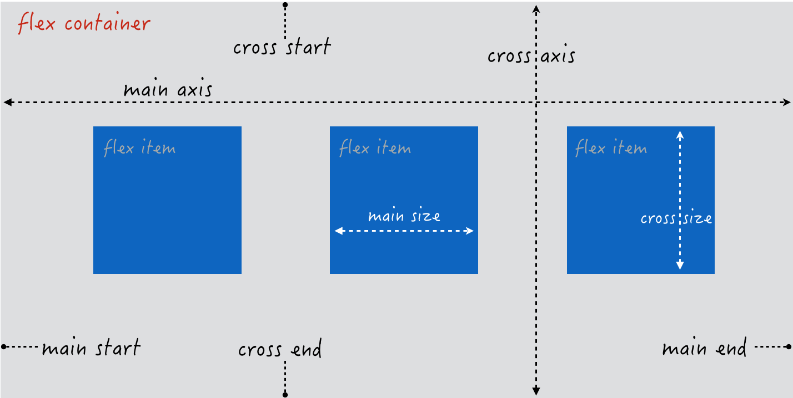
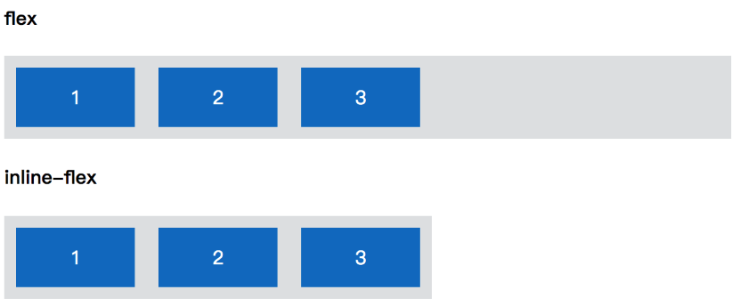
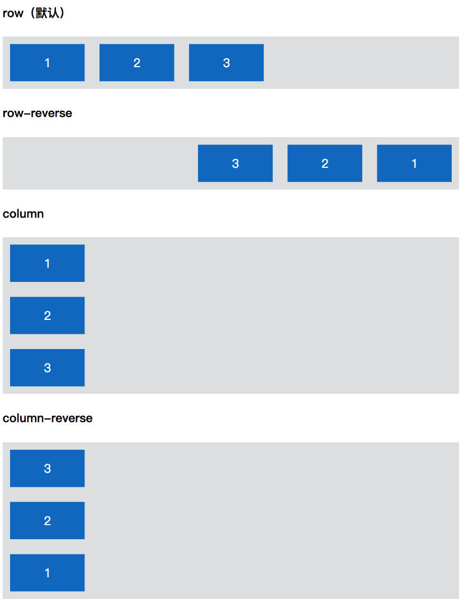
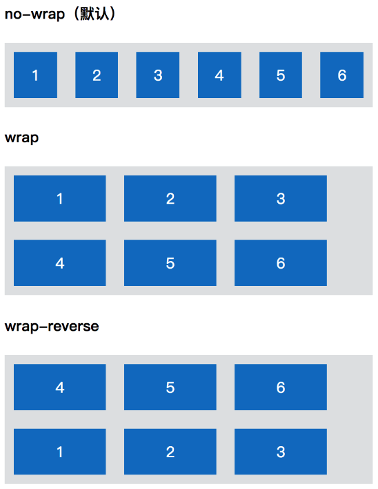
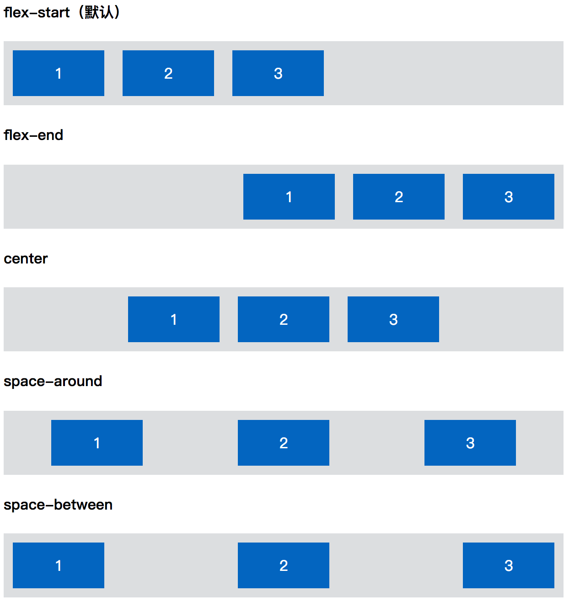
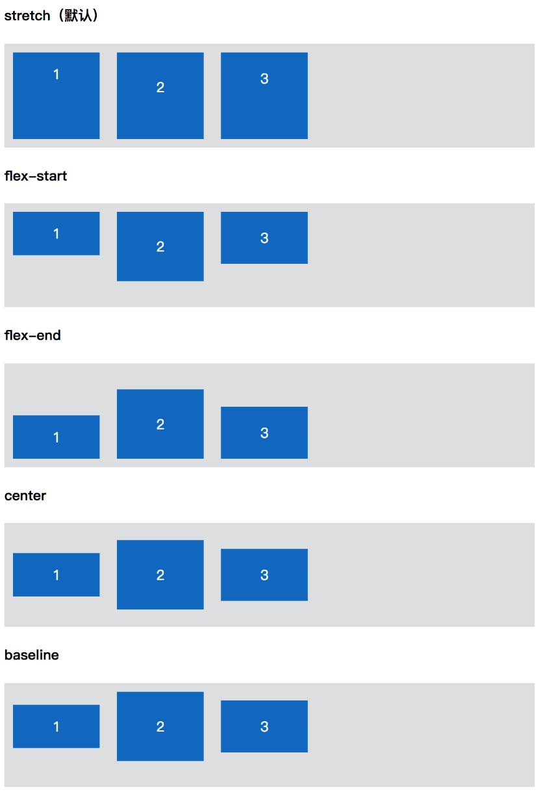
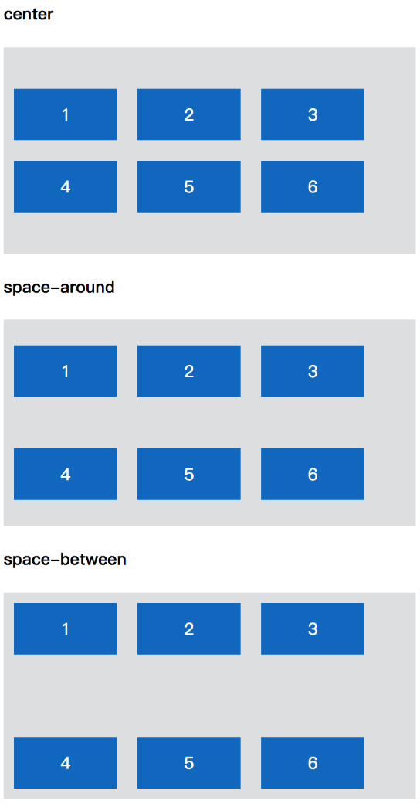

# 基本概念

贴一个很棒的网站：[A Visual Guide To CSS3 Flexbox Properties](https://scotch.io/tutorials/a-visual-guide-to-css3-flexbox-properties)

给一个父元素设置```display:flex```之后，它就变成了一个flex container，其元素变成了flex item.

基本术语：



# Flex container 属性

## display

```
display: flex | inline-flex
```


## flex-direction

``` 
flex-direction: row(默认) | row-reverse | column | column-reverse
```


## flex-wrap

```
flex-wrap: no-wrap | wrap | wrap-reverse
```


nowrap 为不换行，如果 flex container 的宽度不够，则会按照一定比例缩放 flex items， 以达到一行显示在 flex container 中，如上图中的 nowrap 就是缩放了 flex items。

## flex-flow

这是flex-direction和flex-wrap的简写，语法为

```
flex-flow: <flex-direction> || <flex-wrap>
```

## justify-content

定义 flex items 在主轴上的分布方式。默认从主轴开始位置排列。

```
justify-content: flex-start | flex-end | center | space-between | space-around
```

* flex-start 表示主轴开始位置。
* flex-end 表示主轴结束位置。
* center 表示主轴中间位置。
* space-between 表示 flex container 的多余空间在 flex items 之间平均分掉。
* space-around 表示 flex container 的多余空间平均分配到每个 flex item 的左右（跟设置左右 margin 效果一样）。



## align-items

定义 flex items 在交叉轴上的对齐方式。默认为拉伸。

```
align-items: flex-start | flex-end | center | baseline | stretch（默认值）
```

* flex-start 表示交叉轴开始位置。
* flex-end 表示交叉轴结束位置。
* center 表示交叉轴中间位置。
* baseline 表示 flex items 中的文字 baseline。
* stretch 表示所有 flex items 拉伸至 flex container 的交叉轴大小



## align-content

用来定义 flex items 显示为多行的时候，交叉轴上的分布方式。默认从交叉轴开始位置排列。

```
align-content: flex-start | flex-end | center | space-between | space-around | stretch(默认)
```

除了 stretch 外，其余的和 justify-content 的值是一样的，只是方向为交叉轴。而这里的 stretch 拉伸的标准为交叉轴剩余空间的分配。



# Flex item属性

## align-self

用来改变单个flex item的对齐方式。默认的方式继承自flex container的align-items属性

```
align-self: auto | flex-start | flex-end | center | baseline | stretch
```

## order

定义flex item在页面上的显示顺序。数值越小排的越靠前，默认为0，可以为负。

```
order: <integer>
```

## flex-grow

定义 flex item 在 flex container 中还存在剩余空间时的分配比例。默认为 0，即不分配任何空间。

``` 
flex-grow: <number>
```

## flex-shrink

定义 flex item 在 flex container 空间不足时如何缩放。默认为 1。

```
flex-shrink: <number>
```

## flex-basis

定义flex item在分配或者缩放空间时的初始大小，默认为auto，即由flex item的内容决定。

```
flex-basis: <length> | auto
```

如果同时设置了width或height，其权重大于他们

# flex

该属性是flex-grow、flex-shrink、flex-basis的简写，默认值即为他们三个的默认值。

```
flex: none | [ <flex-grow> <flex-shrink> ? || <flex-basis>]
```

除此之外，还需注意：

* auto等同于1 1 auto
* none等同于0 0 auto
* \<positive-number>等同于\<positive-number> 1 0

