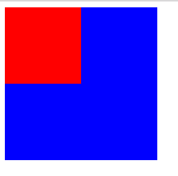

# 标准流 normal flow 概述

html文档的默认排布方式。元素会按照从左往右，从上往下的顺序进行排布。

# 将一个元素从标准流中拽出来的方法

* position的值非static或者relative
* float的值非none

# 格式化上下文 formatting context

Formatting context是W3C CSS2.1规范中提出的概念，它是页面中的一块渲染区域，它有一套规则来决定子元素如何渲染，以及该区域和其他元素的相互作用关系。

# BFC Block Formatting Context

BFC是一个**隔离的容器，里面的元素不会在布局上影响到外面的元素**。并且BFC具有普通容器没有的一些特性。

BFC规定块级子元素的排列，而不是BFC本身。在BFC中，元素会在垂直方向上一个接一个放置。

## 1.触发条件

* body根元素
* float为除none以外的任何值（浮动元素）
* 绝对定位元素：position(absolute fixed)
* display为inline-block、table-cells、flex
* overflow除了visible以外的值(hidden、auto、scroll)
* display: flow-root
* column-span: all
* flex item 和 grid item

## 2.BFC特性及应用

### 2.1 BFC中每个盒子水平占满整个空间

规定宽度，margin:auto可以实现水平居中。

不规定宽度可以实现宽度自适应

### 2.2 元素垂直排列，且同一个BFC下，元素外边距会发生折叠

仅仅针对两个元素**都不是**BFC时。若其中一个是BFC则没有这种影响。

```html
<body>
    <div></div>
    <div></div>
</body>
```

```css
div {
    width: 100px;
    height: 100px;
    margin: 100px;
}
```

在上述两段代码作用下，两个div的距离是100px，而不是200px。如果想取消这种影响，可以把**两个部分分别放在两个不同的BFC中**，如下：
```html
<div class="container">
    <p></p>
</div>
<div class="container">
    <p></p>
</div>
```

```css
.container {
    overflow: hidden;
}

p {
    width: 100px;
    height: 100px;
    margin: 100px;
}
```

这样，两个元素的间距就是200px了。

其实这里为其中一个元素新建一个BFC就可以了，这样就已经满足两个元素位于不同BFC中了。

**合并的规则：**

* 同为正值取最大值
* 一正一负取相加后的值
* 同为负值取绝对值大的

### 2.3 BFC可以包含浮动的元素

首先看这样一个例子：

```html
<div>
    <div style="width:100px;height:100px;background:red;float:left;"></div>
</div>
```

这样的情况下，内部元素脱离文档标准流浮动，外部div元素高度变为0。

如果触发外部容器的某个条件使之成为一个BFC，那么容器会包裹着浮动元素，如下：

```html
<div style="overflow:hidden;">
    <div style="width:100px;height:100px;background:red;float:left;"></div>
</div>
```

### 2.4 BFC可以阻止元素被浮动元素覆盖

如下：浮动的box1覆盖了box2的一部分：

```html
    <div class="box1"></div>
    <div class="box2"></div>
```

```css
.box1 {
    width: 100px;
    height: 100px;
    background: red;
    float: left;
}

.box2 {
    width: 200px;
    height: 200px;
    background: blue;
}
```


如果把box2设置为一个BFC，（简单地给box2加一个```overflow:hidden```即可），那么就会变成下面的效果：


这种思路可以用来实现两栏分布的布局，左边宽度固定，右边自适应

# IFC

* 当块容器盒（block container box）不包括任何块级盒（block-level boxes）时，就会创建一个行内格式化上下文（IFC）。
* 匿名行盒

## 渲染规则

* 盒子水平摆放，容器宽度不够时自动换行
* 每行生成一个匿名行盒，包含改行所有行内级盒
* 水平方向上，所有盒子的宽度之和小于匿名行盒宽度时，水平方向排版由text-align决定
* 垂直方向上，行内级盒的对齐方式由vertical-align决定，默认为baseline
  
  demo: [行内元素的垂直对齐方式](demos/vertical-align.html)
* 行盒高度的计算 :由内部子元素中实际最高的盒子决定。行内盒的垂直Border、padding、margin都不会影响行盒的高度
  
  demo: [行盒的高度](demos/line-height.html)