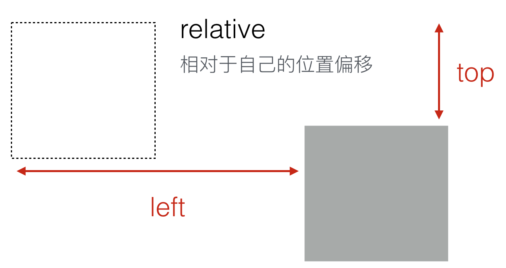
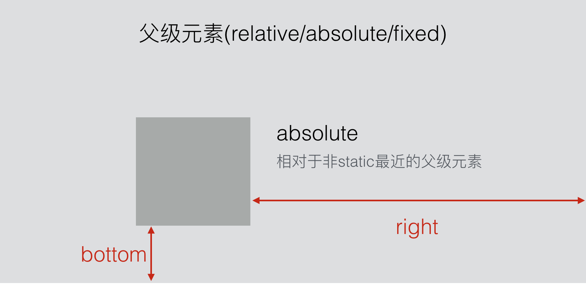
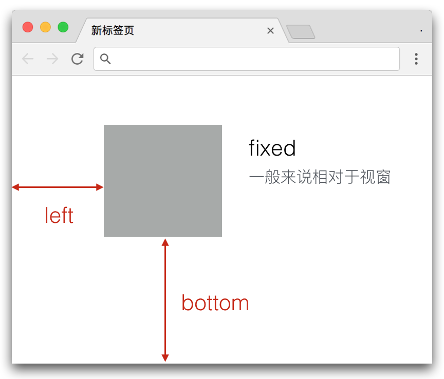
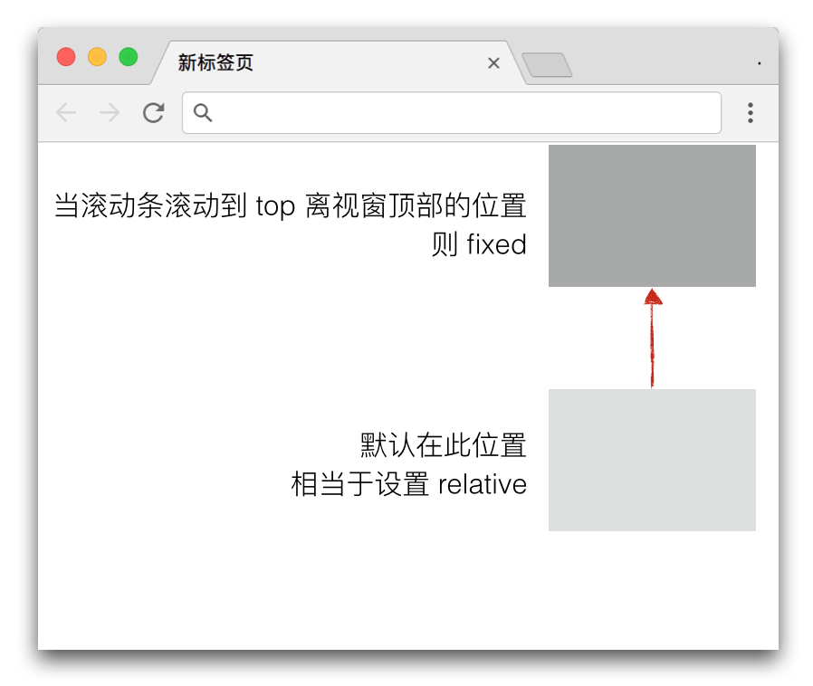

# Position 概述

position属性用于设置元素的定位方式。

用法：

```
position: static | relative | absolute | fixed | sticky(新)
```

在CSS中，position的定位是通过盒子的四条边，即top、left、right、bottom来实现的。

x轴方向用left和right，y轴方向用top和bottom

对于参考位置来说，不同的属性将采用不同的参考对象。

* static: 默认值，不会发生任何偏移
* relative: 相对于自己的偏移
* absolute: 相对于非static最近的父级元素
* fixed: 一般相对于视窗
* sticky: 相对于视窗

# 各个取值详解

demo：[戳我戳我]()

## 1. static

position的默认取值，不做任何偏移。设置left、right、top、bottom都没有用。

如果一个元素设置了非static，后面需要重置该值的时候，就可以将其设为static。

## 2.relative

**relative一般用于给子元素absolute设置参考点。这两个经常一起使用**

只有极少数情况下会给自己偏移。其使用效果如下，设置```position:relative```后再通过top和left进行偏移。下图中虚线表示原始位置，灰色方框表示偏移后的位置。



对relative元素进行偏移不会影响其他兄弟元素的排版，也就是说其他元素仍然依照其初始位置进行排版。

## 3.absolute

absolute为绝对定位，会脱离文档流，作为一个独立的盒子（生成一个BFC）

其偏移参考是**position非static的最近的父元素**。如果任何父元素都不匹配，则参考点为视窗。



absolute定位的容器宽高：

* 若未设置宽度width，则left和right取值都有效，其形成的区域为元素的宽度
* 若设置了宽度width，则同时设置left和right只有left有效，元素的宽度为width的值
* 若未设置高度height，则top和bottom取值都有效，其形成的区域为元素的高度
* 若设置了高度height，则同时设置top和bottom只有top有效，元素的高度为height的值

## 4.fixed

fixed是固定定位，同样会脱离文档流，作为一个独立的盒子。其偏移参考一般为视窗。



如果父级元素有tansform属性，则其偏移参考为最近的设置了transform属性的父级元素。

> For elements whose layout is governed by the CSS box model, any value other than none for the transform results in the creation of both a stacking context and a containing block. The object acts as a containing block for fixed positioned descendants.

## 5.sticky

同样相对于视窗，但是在滚动条滚动该元素位置之前，其效果相当于 relative，只有等到滚动条滚动该元素位置，才变成 fixed。



该属性是新出来的，兼容性有点问题。

上下滚动的sticky，left和right是无效的。

