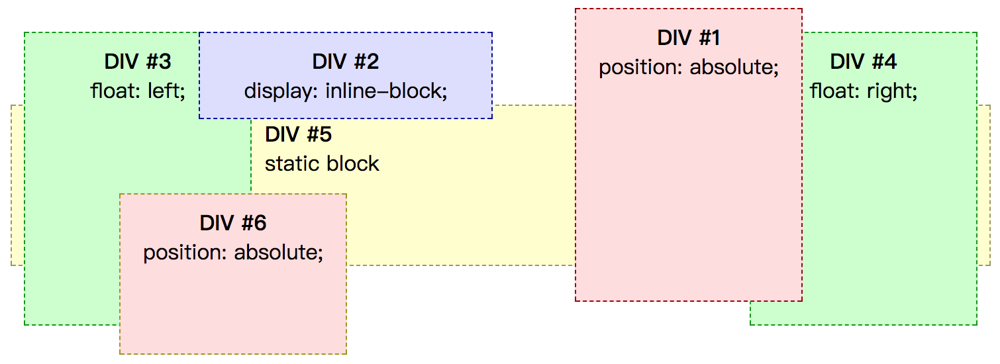

# stack level 和 stack context 概述

stack level决定元素堆叠时在页面上的显示顺序，stack level级别越高，越显示在前面。

stack context限定stack level的作用范围。只有在同一个stack context下的元素stack level才有比较的意义。

# stack context

根元素html会创建一个stack context，除此之外以下情景会创建一个stack context：

* Root element of document (HTML).
* Element with a position value "absolute" or "relative" and z-index value other than "auto".
* Element with a position value "fixed" or "sticky" (sticky for all mobile browsers, but not older desktop).
* Element that is a child of a flex (flexbox) container, with z-index value other than "auto".
* Element with a opacity value less than 1 (See the specification for opacity).
* Element with a mix-blend-mode value other than "normal".
* Element with any of the following properties with value other than "none":
  * transform
  * filter
  * perspective
  * clip-path
  * mask / mask-image / mask-border
* Element with a isolation value "isolate".
* Element with a -webkit-overflow-scrolling value "touch".
* Element with a will-change value specifying any property that would create a stacking context on non-initial value (see this post)

[点我看原文](https://developer.mozilla.org/en-US/docs/Web/CSS/CSS_Positioning/Understanding_z_index/The_stacking_context)

# stack level

同一stack context中，stack level层级按如下顺序递增

1. the background and borders of the element forming the stacking context.
1. the child stacking contexts with negative stack levels (most negative first).
1. the in-flow, non-inline-level, non-positioned descendants.
1. the non-positioned floats.
1. the in-flow, inline-level, non-positioned descendants, including inline tables and inline blocks.
1. the child stacking contexts with stack level 0 and the positioned descendants with stack level 0.
1. the child stacking contexts with positive stack levels (least positive first).

# 没有z-index的情况

stack level大致按以下顺序递增

1. 块级元素
2. 浮动元素
3. 行内级元素
4. position非static元素

大致如下



# 设置z-index的情况

z-index属性表示一个具有position属性的元素及其子元素在Z轴上的层级。它指定了了

* 元素在当前stack context中的stack level
* 元素是否创建一个新的stack context

position为static的元素，z-index无意义。

其取值有```auto | <integer> ```

* auto
  
  stack level为0。若其position为fixed或者根元素，其会创建一个新的stack context，否则不会。

* \<integer>
  
  该数值就是该元素在该stack context下的stack level，同时该元素会创建一个新的stack context。

**auto与0的区别:** auto除了xxx，不会创建新的stack context，而0一定会创建新的stack context


# 总结

要比较两个元素的层级，首先要确定其stack context。

* 若在同一个stack context下，则按照上述规则比较
* 若不在同一个stack context下，则向上寻找他们的父元素，直到它们同在一个stack context，然后按照上述规则比较这两个元素