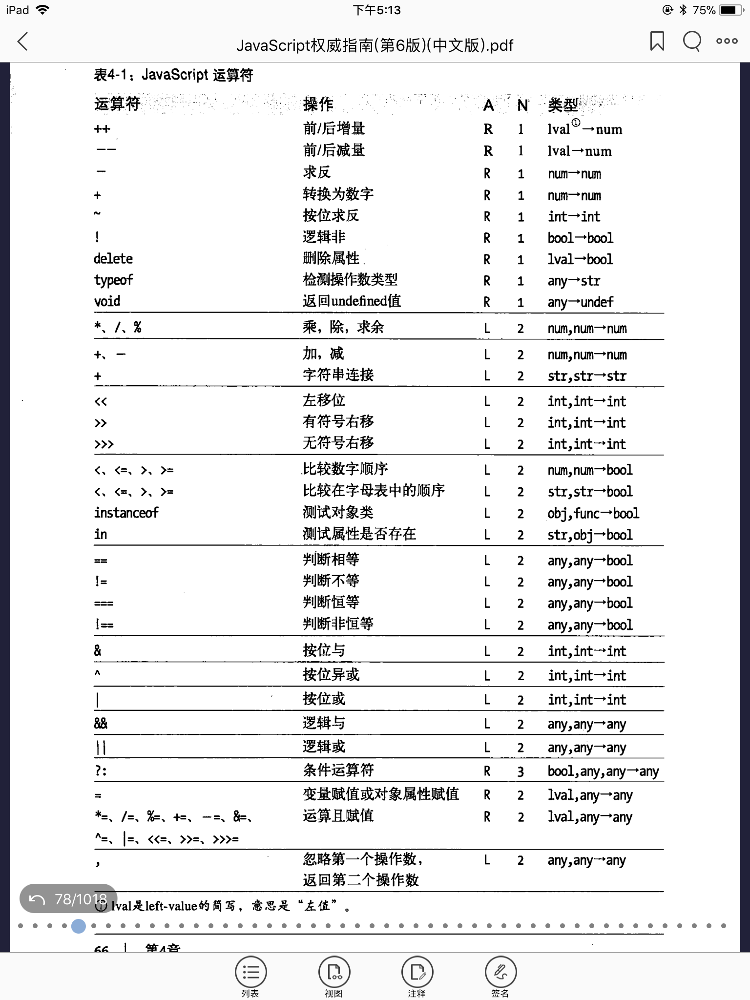

# 表达式 没啥好说的= =

# 运算符

## 优先级
图片注释：A表示结合性（从哪边到哪边）， N表示操作数个数

## 左值？？

## 位运算符

* &
* |
* ~
* ^
* <<
* \>\>
* \>\>\>

## 相等运算符和不等运算符

> 相等运算符 == 

> 严格相等运算符 ===

* null == undefined
* 0 == -0
* 5 == "5" =>把字符串转化为数字
* 其中一个是true，转化为1再进行比较。false转为0
* 对象转化为原始值再进行比较(valueOf() or toString())

## instanceof

## 逻辑运算符

### 逻辑与&& 

从三个层面理解：

* 第一层：当操作数都是布尔值，就是普通的与操作
* 第二层：操作数是真值或者假值，返回他们的与的结果。假值:false, null, undefined, 0, -0, NaN, ''，其余为真值。从这个层面看，&&并不总是返回true和false
* 第三层：操作符首先计算左边表达式，如果是假值，那么整个式子为假值，直接返回左边的操作数；若左边为真，则返回右边的操作数的值作为整个式子的结果