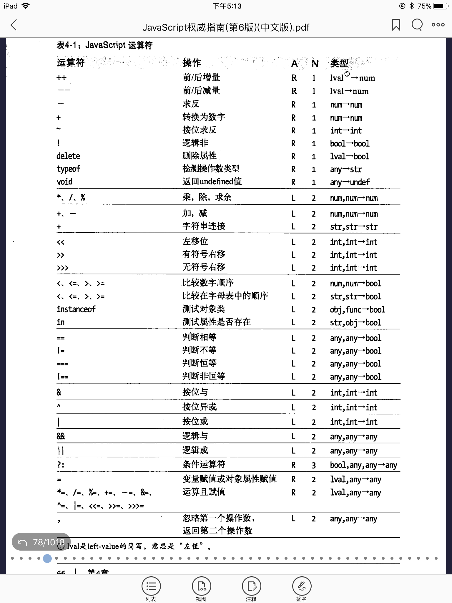

# 表达式 没啥好说的= =

***

# 运算符


## 优先级
图片注释：A表示结合性（从哪边到哪边）， N表示操作数个数


## 左值？？

## 位运算符

* &
* |
* ~
* ^
* <<
* \>\>
* \>\>\>

## 相等运算符和不等运算符

> 相等运算符 ==

> 严格相等运算符 ===

* null == undefined
* 0 == -0
* 5 == "5" =>把字符串转化为数字
* 其中一个是true，转化为1再进行比较。false转为0
* 对象转化为原始值再进行比较(valueOf() or toString())

## instanceof

## 逻辑运算符

### 逻辑与&& 

从三个层面理解：

* 第一层：当操作数都是布尔值，就是普通的与操作
* 第二层：操作数是真值或者假值，返回他们的与的结果。假值:false, null, undefined, 0, -0, NaN, ''，其余为真值。从这个层面看，&&并不总是返回true和false
* 第三层：操作符首先计算左边表达式，如果是假值，那么整个式子为假值，直接返回左边的操作数；若左边为真，则返回右边的操作数的值作为整个式子的结果

### 逻辑或||

理解方式同上。注意一种常见的写法，__给参数提供默认值__：
    
    var fn = function(array){
        var a = array || []; //如果array存在就赋值给a，否则新建一个数组a
        /*balabalabala*/
    }

还有一种，__从一组备选值里选出第一个真值表达式__：

    var max = max_width || default.max_width || 500;

### 逻辑非！

它与上述两个不同，它只返回true or false，它永远先将操作数转为布尔值。下述语句将表达式转化为等价的布尔值：

    var bool = !!statement;

## 赋值操作符 =

它的左边是一个左值：变量或者对象属性。右边任意。赋值表达式的值是右边的值。

    var a = 1;
    (a = 0) == 0; //true

由于赋值操作符从右到左结合，可以使用如下表达式对多个变量赋值：

    a = b = c = 0;

## 其他运算符

* 条件运算符（三目运算符）？：

* typeof 
        
        typeof x;
        typeof(x);

  返回代表操作数类型的字符串。"object"(null 也是), "undefined", "function", "number", "boolean", "string"

* delete

  删除对象属性或者数组元素（与c++不同，js内存回收是自动的，不用自己删）
  
  注意：delete删除数组元素不改变数组长度，只是留个一个“洞”(undefined)

  不能删除通过var语句声明的变量、函数。

* void

  操作数正常计算，但是忽略计算结果并返回undefinde
  ```
    var a = 1;
    var b = void (function(){return ++a;})();
    /*注意这种写法，定义函数并立即执行*/
  ```
  执行之后，a变为2，但是b是undefined

* 逗号运算符(wtf这也是运算符？)

  二元运算符，先计算左操作数再计算右操作数，最后返回右操作数的结果。